# YellowTrips 2019 — Databricks Lakehouse Mini-Pipeline
PySpark project on 2019 NYC Yellow Taxi: ingest, clean, enrich, partitioned Parquet outputs, performance tuning (Photon/broadcast/partition pruning), and baseline ML.

## Overview
Build an end-to-end Spark pipeline on Databricks that:

- Ingests 2019 NYC Yellow Taxi trips (Parquet) + zone lookup (CSV)

- Cleans & enriches data (time features, sanity filters, geo lookup)

- Aggregates to a partitioned feature mart (Delta/Parquet by year, month)

- Demonstrates performance basics (early filters, column pruning, broadcast join, Photon)

- Trains a lightweight ML model (Linear Regression baseline) to predict tip amount

## Data & Locations

- Data source: [NYC Taxi & Limousine Commission (TLC) Trip Record Data (Yellow Taxi, 2019) and Taxi Zone Lookup](https://www.nyc.gov/site/tlc/about/tlc-trip-record-data.page)

- Locations:

    - Trips (Parquet, 2019 months): /Volumes/workspace/default/nyc_taxi/2019/

    - Lookup (CSV): /Volumes/workspace/default/nyc_taxi/lookup/taxi_zone_lookup.csv

    - Outputs (partitioned feature mart): /Volumes/workspace/default/nyc_taxi/out_base/

## Pipeline steps

### Load
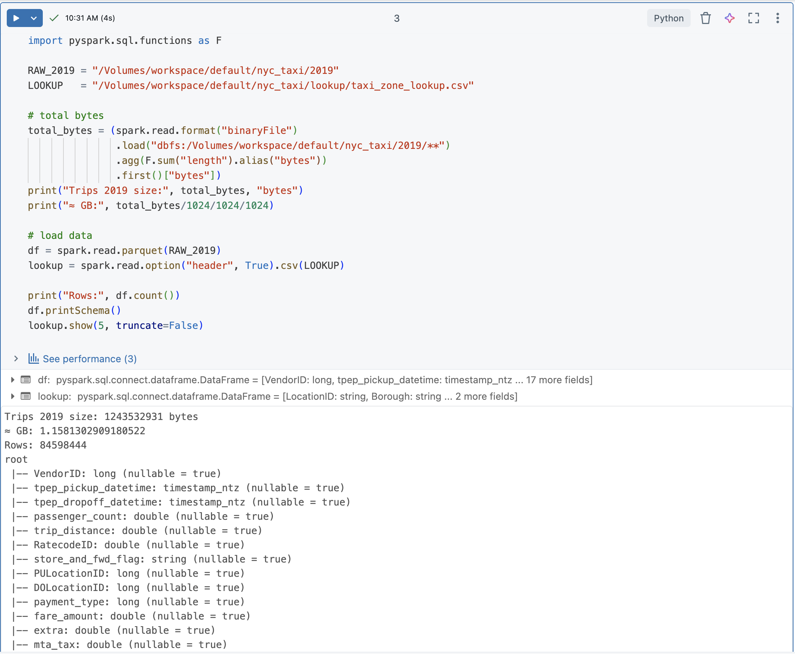

### Transformation
- Early filters: fare_amount > 0, trip_distance > 0, 1 ≤ passenger_count ≤ 6

- Column transformations using withColumn:
    - Time features: pickup_ts, dropoff_ts, year, month, pickup_hour, trip_mins
    - Tip %: tip_pct = tip_amount/total_amount (guard divide-by-zero)

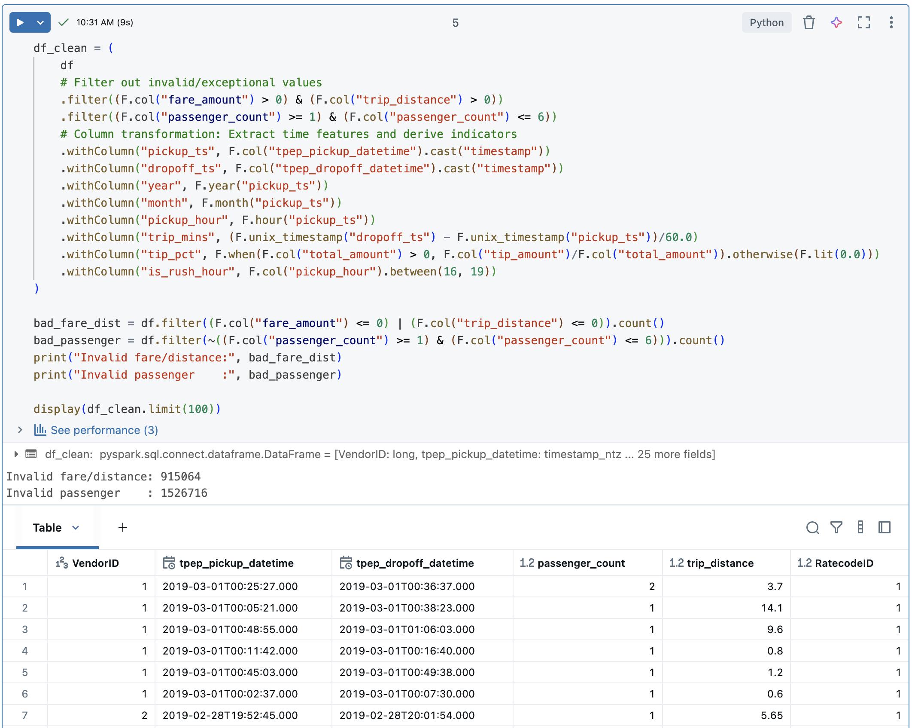

### Enrich (broadcast join)

- Keep a minimal lookup frame (PULocationID, Borough, Zone)

- broadcast(lookup_small) to avoid shuffles

- Result: df_enriched adds PU_Borough/PU_Zone for analysis

### Aggregate → feature mart (partitioned)
Turn raw trips into a small summarized table for downstream analysis.

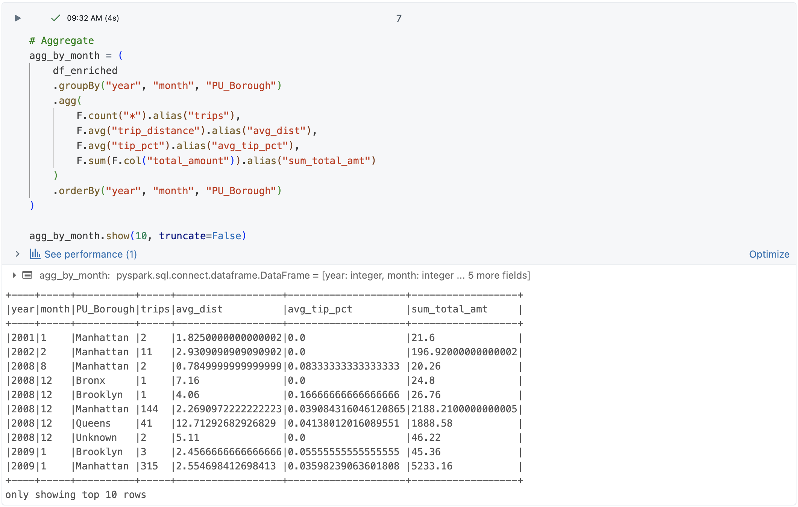
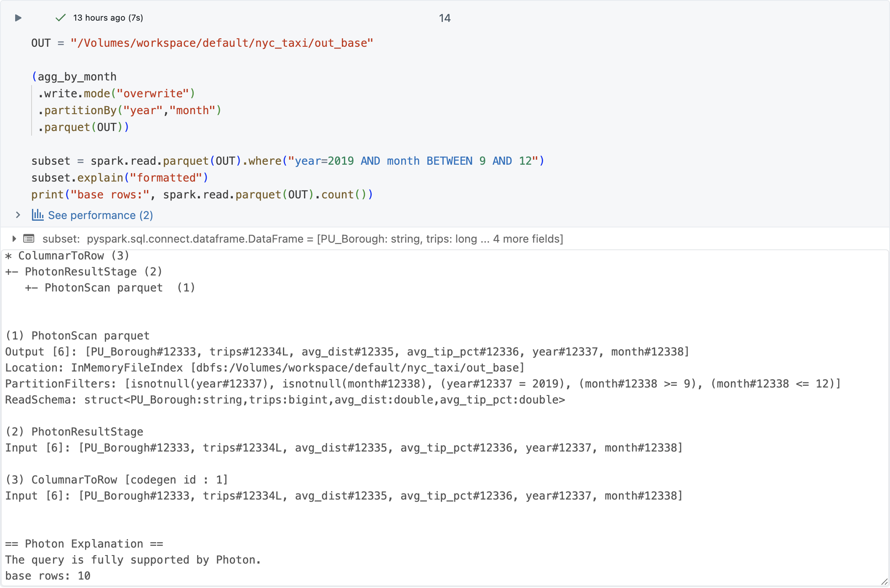

- Read-back validation

    - Row count parity: spark.read.parquet(OUT).count()

    - Partition pruning: spark.read.parquet(OUT).where("year=2019 AND month BETWEEN 9 AND 12")

### SQL queries
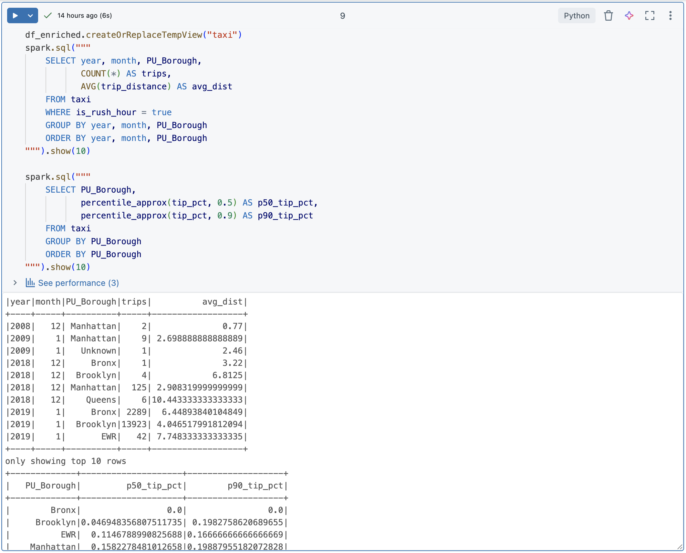

## Performance checklist

- Early filters & column pruning

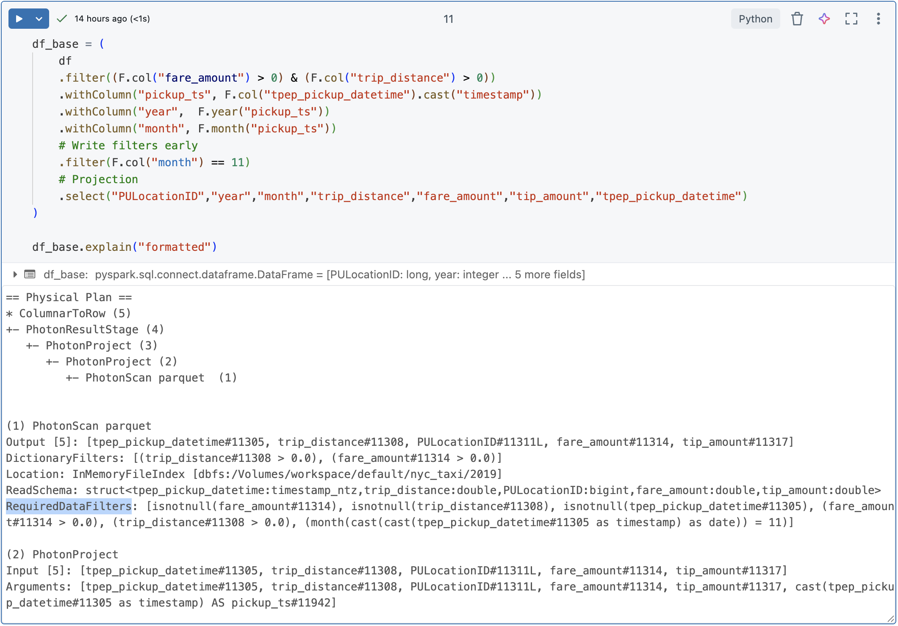

- Broadcast join

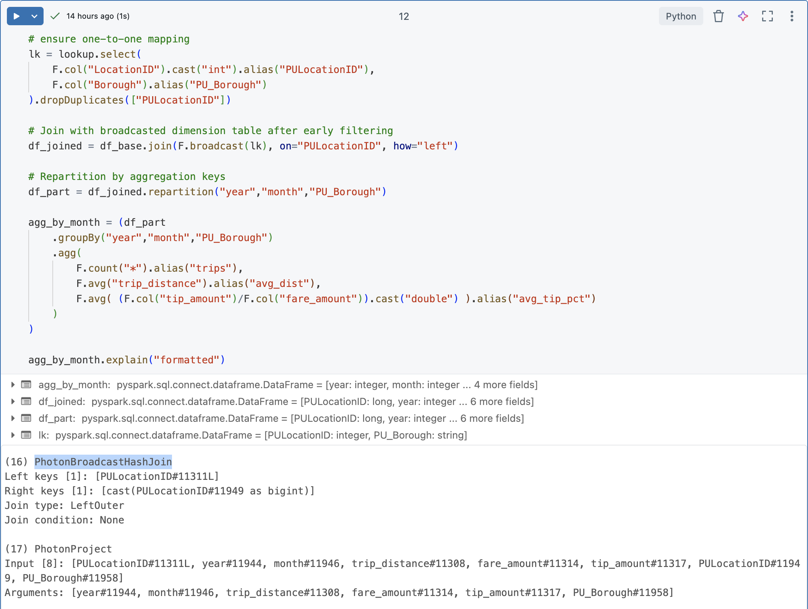

- Partition pruning

- How Spark optimized my query

    - Early filters: In the scan node, the plan shows filters like fare_amount > 0, trip_distance > 0. These run at read time, so Spark reads less data.

    - Column pruning: The scan ReadSchema includes only the columns I selected. This saves I/O and memory.

    - Broadcast join: I broadcast the small zone lookup. The plan shows BroadcastHashJoin (or Photon version). This avoids a big shuffle.

    - Partition pruning: When reading the output table, the plan shows PartitionFilters (e.g., year = 2019 AND month BETWEEN ...). Spark reads only those partitions.

- Where filters were pushed down

    - In the cleaning step, filters like fare_amount > 0, trip_distance > 0, and 1 ≤ passenger_count ≤ 6 appear in RequiredDataFilters/DictionaryFilters in the scan.

    - When reading a subset of months, the plan shows PartitionFilters on year and month.

- Bottlenecks I saw

    - Schema merge cost when reading many monthly Parquet files the first time.

    - Join without broadcast (if I forget it) can cause a large shuffle.

    - Wide scans if I select * instead of needed columns.

    - Platform limits on Serverless (no CLEAR CACHE/PERSIST TABLE; large ML models may hit size limits).

- How I optimized the pipeline

    - Put filters early, before heavy transforms.

    - Use column pruning (select(...)) before join/agg.

    - Broadcast the small lookup table.

    - Repartition by year, month, PU_Borough before groupBy to reduce shuffle skew.

    - Write partitioned by (year, month) so reads can prune partitions.

## Actions vs Transformations

These screenshots demonstrate Spark’s lazy evaluation: transformations only build a plan; actions (e.g., count(), show()) actually run the plan and appear in Query Details as executed jobs.

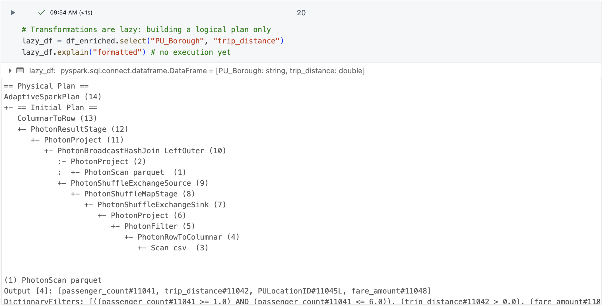
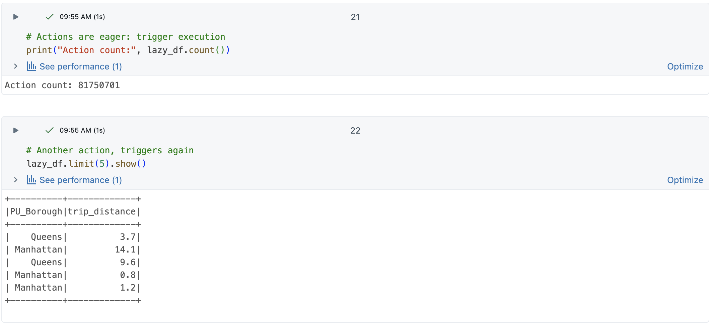

## Modeling (MLlib)

A quick Linear Regression baseline to turn the pipeline into an ML story:

- Assemble features: trip_distance, passenger_count, pickup_hour, is_rush_hour, trip_time_min, fare_amount, fare_per_mile

- Train/test split; print RMSE/R²; preview predictions.

- Key findings from the analysis:

    - `distance` is positive (longer trips → higher tips); 
    - `is_rush_hour` shows a small positive effect; 
    - `passenger_count` is small; 
    - `intercept ≈ 0.95` suggests a baseline tip near $1 for very short trips.

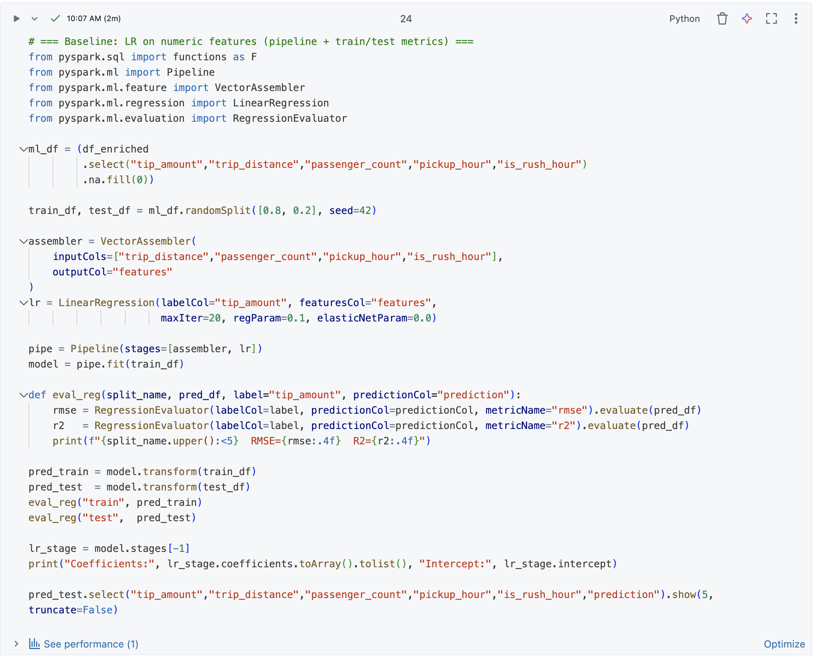
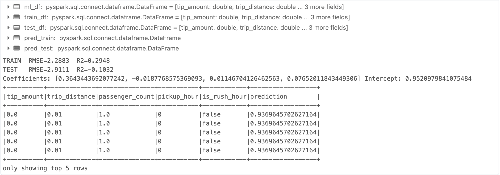